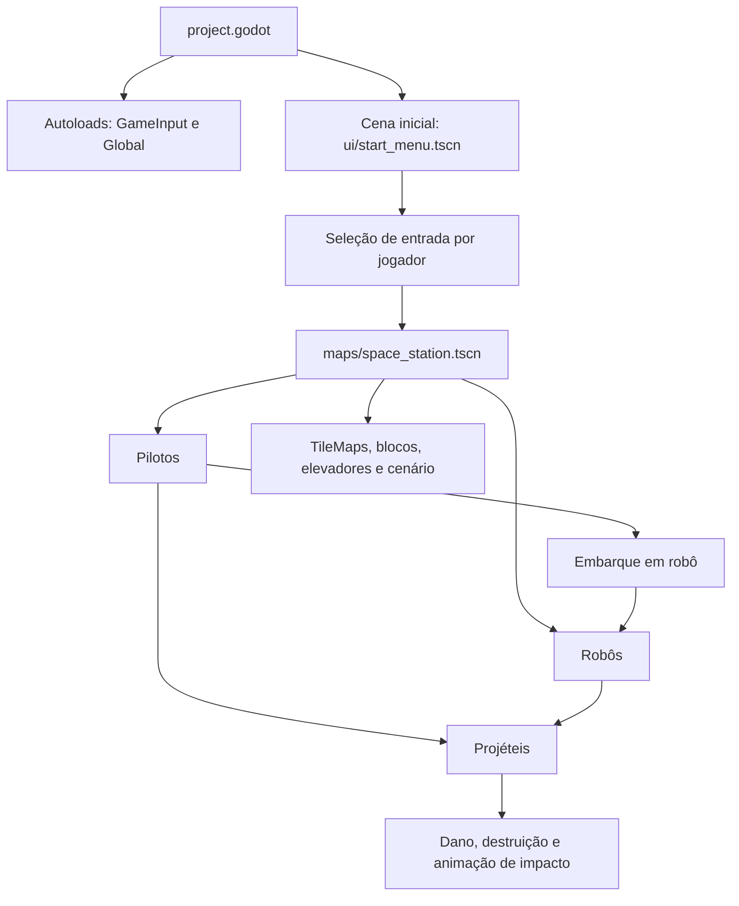

# Arquitetura e funcionamento do Metal Warriors

Este documento descreve a estrutura atual do projeto Godot, o papel das cenas e
scripts, e os principais fluxos de jogo. Os caminhos usam o formato `res://`,
relativo à raiz do projeto.

## 1. Visão geral

Metal Warriors é um jogo 2D de ação com dois pilotos que podem lutar a pé ou
embarcar em robôs. A composição do jogo é baseada em cenas reutilizáveis:
pilotos, robôs, projéteis e elementos da fase são cenas independentes instanciadas
na cena do mapa.



O ponto de entrada configurado em `project.godot` é
`res://scenes/ui/start_menu.tscn`. A fase carregada pelo menu é
`res://scenes/maps/space_station.tscn`.

## 2. Configuração do projeto

`project.godot` configura o nome do jogo, Godot 4.7, a cena inicial, os
autoloads, as ações de teclado e os nomes das camadas de física 2D.

### Autoloads

| Autoload | Script | Responsabilidade |
| --- | --- | --- |
| `GameInput` | `scripts/game_input.gd` | Descoberta de controles, atribuição das entradas aos jogadores e menu de pausa. |
| `Global` | `scripts/global.gd` | Enumerações e tabelas compartilhadas para estados, tipos de projétil/bloco/elevador e materiais de cor. |

Os autoloads permanecem disponíveis durante as mudanças de cena.

### Ações padrão do teclado

As ações legadas em `project.godot` definem o mapa base que `GameInput` copia
para as ações isoladas de cada jogador quando este usa o teclado.

| Ação | Teclado atual |
| --- | --- |
| Movimento | `W`, `A`, `S`, `D` |
| `button_north`, `button_east`, `button_south`, `button_west` | Setas para cima, direita, baixo e esquerda, respectivamente |
| `shoulder_left`, `shoulder_right` | `Q` e `E` |
| `button_select` | `Shift` |

As ações `p1_<ação>` e `p2_<ação>` são criadas em tempo de execução. Os
controladores usam o D-pad e o eixo analógico esquerdo para movimento; os botões
A/B/X/Y mapeiam para south/east/west/north, os ombros para shoulder_left/right
e o botão Back para `button_select`.

Camadas 2D nomeadas no projeto:

| Camada | Nome |
| --- | --- |
| 1-8 | `Player 1` até `Player 8` |
| 9 | `walls` |
| 10 | `bullets` |
| 11 | `pilots` |
| 12 | `blocks` |
| 13 | `destructible_walls` |
| 14 | `elevators` |
| 15 | `remote_shields` |

O projeto nomeia essas camadas; as máscaras e camadas efetivas de cada objeto
continuam configuradas nas cenas.

## 3. Entrada, menu inicial e pausa

### Seleção de entrada

`GameInput` consulta `Input.get_connected_joypads()` no início e quando o sinal
`Input.joy_connection_changed` é emitido. No modo automático, ordena os IDs dos
controles conectados, atribui o primeiro a P1 e o segundo a P2, e usa o teclado
nas vagas sem controle. Cada jogador também pode selecionar manualmente
Automático, Teclado ou um controle no menu.

Cada piloto tem dois identificadores distintos:

- `input_slot`: identifica o conjunto de entradas (1 para P1, 2 para P2).
- `id`: identidade visual usada pelo sistema de cores do robô.

Na fase atual, P1 tem `id = 3` e `input_slot = 1`; P2 tem `id = 2` e
`input_slot = 2`. Não se deve confundir o número de jogador com a cor.

Sem controles conectados, as duas vagas usam o mesmo mapa de teclado existente.
Isso significa que ambos respondem às mesmas teclas, não que o jogo forneça dois
conjuntos independentes de teclas.

### Cena do menu

`scenes/ui/start_menu.tscn` contém um único nó `Control` (`StartMenu`); seu
script cria os demais controles da interface durante `_ready()`:

```text
StartMenu (Control)
├── ColorRect (fundo)
└── CenterContainer
    └── VBoxContainer
        ├── Label (título)
        ├── Label (instrução)
        ├── HBoxContainer (Jogador 1 + OptionButton)
        ├── HBoxContainer (Jogador 2 + OptionButton)
        ├── Label (quantidade de controles)
        └── Button (Iniciar ou Retomar)
```

`scripts/ui/start_menu.gd` constrói os menus inicial e de pausa por meio da
propriedade exportada `pause_menu`. No menu inicial, o botão muda para a cena da
estação. No menu de pausa, o botão retoma o jogo.

### Menu de pausa

`GameInput._input()` escuta teclas enquanto a cena corrente é a estação:

- `Esc` abre o menu e pausa `SceneTree`; pressionar `Esc` novamente retoma.
- `Enter`/Return ou Enter do teclado numérico abre o menu quando a partida está ativa.
- Com o menu aberto, o foco inicial está em **Retomar**; ativá-lo com Enter
  retoma a partida.

O menu de pausa é uma instância do menu inicial colocada em um `CanvasLayer` com
`PROCESS_MODE_ALWAYS`, para continuar processando mesmo com o restante da árvore
pausada.

## 4. Cena principal: estação espacial

`scenes/maps/space_station.tscn` tem o nó raiz `MapSpaceStation` (`Node2D`) e
85 nós declarados no arquivo. A árvore funcional é:

```text
MapSpaceStation (Node2D)
├── Players (Node)
│   ├── Player1 (instância de Pilot)
│   │   └── Camera2D
│   └── Player2 (instância de Pilot)
├── Robots (Node)
│   ├── Nitro (instância de Nitro)
│   ├── Drache (instância de Drache)
│   └── Prometheus (instância de Prometheus)
├── TileMaps (Node)
│   ├── Walls (TileMapLayer)
│   └── DestructibleWalls (TileMapLayer + destructible_walls.gd)
├── Blocks (Node2D)
│   └── Block ... Block56 (56 instâncias de scenes/stage/block.tscn)
├── Elevators (Node)
│   ├── Elevator (instância de Elevators)
│   ├── ElevatorFloor (instância visual)
│   └── ElevatorBackGround ... ElevatorBackGround8 (8 instâncias visuais)
├── Ports (Node)
│   ├── Port (instância visual)
│   └── Port2 (instância visual)
├── Background (TextureRect)
└── Music (AudioStreamPlayer2D)
```

O mapa mantém os dados das paredes e das paredes destrutíveis em dois
`TileMapLayer`s separados. `Walls` usa o TileSet de paredes não destrutíveis;
`DestructibleWalls` usa outro TileSet e delega os impactos ao script
`destructible_walls.gd`.

Os blocos e demais objetos são cenas instanciadas com posições e propriedades
gravadas no mapa. Assim, editar uma instância de bloco reutilizável não exige
alterar sua lógica para cada posição.

## 5. Cenas reutilizáveis e árvores de nós

### Piloto

`scenes/pilot.tscn`:

```text
Pilot (CharacterBody2D + pilot.gd)
├── BodyAnimatedSprite2D
├── BodyCollisionShape2D
├── Area2D
│   └── CollisionShape2D
└── AnimationPlayer
```

O `CharacterBody2D` representa o movimento e a colisão física. O `Area2D`
detecta robôs próximos para embarque. O `AnimationPlayer` coordena animações de
embarque e ejeção.

### Robôs

As três cenas herdam a lógica base de `Robot`, que por sua vez herda de
`Playable`.

| Cena / raiz | Nós filhos principais | Papel |
| --- | --- | --- |
| `robots/nitro.tscn` / `Nitro` (`CharacterBody2D`) | `BodyAnimatedSprite2D`, `Cannon/CannonAnimatedSprite2D`, `BodyCollisionShape2D`, `BoardingArea2D/CollisionShape2D`, `ShieldCollisionShape2D` | Robô terrestre com salto/voo, canhão, escudo e escudo remoto. |
| `robots/drache.tscn` / `Drache` (`CharacterBody2D`) | `BodyAnimatedSprite2D`, `BodyCollisionShape2D`, `ShotAnimatedSprite2D`, `ShieldCollisionShape2D`, `BoardingArea2D/CollisionShape2D`, `PowerDiveArea2D/CollisionShape2D` | Robô voador com disparos direcionais e mergulho ofensivo. |
| `robots/prometheus.tscn` / `Prometheus` (`CharacterBody2D`) | `BodyAnimatedSprite2D`, `BodyCollisionShape2D`, `Cannon/CannonAnimatedSprite2D`, `BoardingArea/CollisionShape2D`, `BlockBuildingArea/CollisionShape2D`, `FireArea/CollisionShape2D` | Robô terrestre com canhão pesado, lança-chamas e construção de blocos. |

O `BoardingArea` é uma `Area2D`, separada da colisão do corpo. As áreas de
construção, fogo e mergulho são usadas para verificar sobreposições ou aplicar
dano em vários corpos.

### Projéteis

Todas as cenas de projétil usam o mesmo script `scripts/bullet.gd` e a mesma
estrutura:

```text
NomeDoProjetil (Area2D + bullet.gd)
├── AnimatedSprite2D
└── CollisionShape2D
```

| Cena | Tipo em `Global.BulletType` | Uso |
| --- | --- | --- |
| `bullets/pistol.tscn` | `DEFAULT` | Disparo do piloto. |
| `bullets/fusion_rifle.tscn` | `DEFAULT` | Arma do Nitro. |
| `bullets/energy_cannon.tscn` | `ENERGY_CANNON` | Disparo do Drache; recebe variação aleatória de direção. |
| `bullets/mega_cannon.tscn` | `MEGA_CANNON` | Disparo carregado do Prometheus; ao explodir, cria fragmentos em oito direções. |
| `bullets/aerial_mine.tscn` | `AERIAL_MINE` | Mina aérea com movimento lateral aleatório limitado. |
| `bullets/fragment.tscn` | `DEFAULT` | Projétil filho criado pela mega cannon. |

## 6. Scripts e responsabilidades

### Núcleo de jogador e robôs

| Script | Responsabilidade |
| --- | --- |
| `scripts/abstract/playable.gd` | Base `CharacterBody2D`: aceleração, fricção, gravidade, espelhamento de sprites, cálculo de ângulo e leitura das ações por `input_slot`. |
| `scripts/abstract/robot.gd` | Base dos robôs: estados comuns, vida, embarque/ejeção, dano, explosão e material visual. |
| `scripts/pilot.gd` | Máquina de estados do piloto (`WALK`, `FLY`, `ROBOT`), movimento, disparo, mira, embarque e retorno após ejeção. |
| `scripts/robots/nitro.gd` | Estados de andar, salto, queda, voo, pouso e escudo; dispara fusion rifle e cria/retira escudo remoto. |
| `scripts/robots/drache.gd` | Voo, disparo em oito direções e mergulho que causa dano na área de ataque. |
| `scripts/robots/prometheus.gd` | Movimento, queda, canhão, minas, lança-chamas por área, escudo e criação de blocos. |

Quando um piloto embarca, o robô guarda a referência ao piloto. A entrada do
robô passa então a usar o `input_slot` desse piloto, mantendo controle e cor
separados. A rotina de embarque verifica a `Area2D` do piloto e procura um
objeto próximo que responda a `is_empty_robot()`.

### Fase e combate

| Script | Responsabilidade |
| --- | --- |
| `scripts/bullet.gd` | Movimento, variação de trajetória de alguns tipos, colisão, dano, animação de impacto e fragmentos. |
| `scripts/stage/block.gd` | Vida do bloco, seleção da animação conforme a vida e desativação da camada de colisão ao ser destruído. |
| `scripts/stage/destructible_walls.gd` | Converte a posição atingida para coordenada do TileMap e apaga a célula. |
| `scripts/stage/elevator.gd` | Movimento vertical entre altura inicial e limite, com pausa nos extremos. |
| `scripts/stage/remote_shield.gd` | Escudo com pontos de vida e tempo de vida; remove a instância ao expirar ou ser destruído. |

O projétil recebe `body_entered` em tempo de execução. No impacto, chama
`hit(damage)` se o alvo oferecer esse método; caso contrário, tenta
`hit_at(damage, global_position)`. Depois executa `explode()`. O shape da
colisão é desativado com `set_deferred()` para não alterar o estado físico
durante o processamento de consultas.

### Outros scripts

| Script | Responsabilidade |
| --- | --- |
| `scripts/global.gd` | Enumeradores `RobotState`, `BulletType`, `BlockType`, `ElevatorType` e tabelas de nomes e cores. |
| `scripts/game_input.gd` | Autoload de dispositivos, ações por jogador e pausa. |
| `scripts/ui/start_menu.gd` | Montagem da interface do menu em runtime, seleção de entrada, início e retomada. |
| `scripts/split_screen/viewports.gd` | Redimensiona viewports e aponta câmeras aos jogadores na cena de split-screen estático. |
| `scripts/split_screen/camera.gd` | Segue o alvo atribuído pela cena de split-screen. |
| `scripts/split_screen/voronoi_camera_controller.gd` | Lógica de uma divisão dinâmica por shader; não está conectada a uma cena ativa do projeto no momento. |
| `addons/PaletteSwap/PaletteGenerator.gd` | Ferramenta de editor para gerar uma imagem-base de paleta a partir das cores de uma textura selecionada. |

## 7. Máquinas de estado e fluxos de jogo

### Piloto

1. `WALK`: movimenta no chão, aplica gravidade, mira e dispara a pistola.
2. Segurar `button_south` muda para `FLY`, usando a velocidade de voo.
3. Soltar o botão de voo retorna para `WALK`.
4. `button_select` procura robôs vazios na área de embarque; ao encontrar um, o
   piloto chama `board()`, desativa temporariamente a colisão do corpo e segue a
   posição do robô.
5. A ejeção é iniciada pelo robô; após a animação, o piloto deixa o estado
   `ROBOT` e recupera a colisão.

### Robô base

Um robô começa `UNBOARDED`, salvo se `init_boarded` estiver habilitado para
depuração. O embarque atribui o piloto, aplica sua paleta ao robô e executa a
animação de inicialização. Dano reduz `hp`; a razão de dano atualiza o shader.
Ao atingir zero, o robô toca a animação de explosão apropriada ao estado e é
removido da árvore.

### Tipos de robô

- **Nitro:** o salto começa uma animação de pulo; manter o botão leva ao voo.
  Soltar enquanto cai encerra o voo; o pouso pode tocar uma animação própria.
  Segurar o ombro direito levanta o escudo; `button_north` cria um escudo remoto.
- **Drache:** move em duas dimensões no ar. Combinações dos quatro botões
  direcionais de ação selecionam os oito ângulos do canhão. O ombro direito
  inicia o mergulho e o `PowerDiveArea2D` causa dano periódico.
- **Prometheus:** o lança-chamas danifica corpos na `FireArea`; o botão de
  construir cria um bloco se `BlockBuildingArea` estiver livre; o ombro direito
  ativa o escudo. A mega cannon e a mina têm intervalos de disparo separados.

## 8. Outras cenas e câmera

### Elementos de fase

| Cena | Árvore resumida | Script |
| --- | --- | --- |
| `stage/block.tscn` | `Block (StaticBody2D)` → `CollisionShape2D`, `AnimatedSprite2D` | `stage/block.gd` |
| `stage/elevator.tscn` | `Elevator (AnimatableBody2D)` → `AnimatedSprite2D`, `CollisionShape2D` | `stage/elevator.gd` |
| `stage/elevator_floor.tscn` | `ElevatorFloor (AnimatedSprite2D)` | Nenhum |
| `stage/elevator_bg.tscn` | `ElevatorBackGround (AnimatedSprite2D)` | Nenhum |
| `stage/port.tscn` | `Port (Node2D)` → dois `AnimatedSprite2D` | Nenhum |
| `stage/remote_shield.tscn` | `RemoteShield (StaticBody2D)` → `AnimatedSprite2D`, `CollisionShape2D` | `stage/remote_shield.gd` |

### Split-screen

`scenes/split_screen/static_split_screen.tscn` é uma cena alternativa, não a
cena principal configurada. Sua árvore usa `HBoxContainer`, dois
`SubViewportContainer`s, dois `SubViewport`s e uma câmera por viewport. O mapa é
instanciado no primeiro viewport; `viewports.gd` compartilha seu `world_2d` com
o segundo e associa as câmeras a `Players/Player1` e `Players/Player2`.

O script `voronoi_camera_controller.gd` contém uma abordagem diferente, que
ajusta câmeras e parâmetros de shader em função da distância dos jogadores.
Atualmente não há cena `.tscn` que o instancie, portanto essa lógica não integra
o fluxo padrão descrito acima.

## 9. Arte, animação e paletas

- `assets/robots`, `assets/bullets`, `assets/stage` e `assets/maps` guardam as
  texturas usadas pelas cenas.
- `assets/music` contém a trilha referenciada pelo mapa.
- `assets/palettes` contém paletas de cor e a paleta usada para representar
  dano.
- `shaders/robot.gdshader` compara a cor original do sprite com a primeira linha
  da paleta, substitui a cor pela paleta do robô e mistura com a paleta de dano
  conforme `damage_percent`.
- `scenes/shader_material` contém os `ShaderMaterial`s de cor (vermelho, azul,
  verde e amarelo). `Global.colour_materials` fornece sua ordem para o ID visual
  do piloto.
- As cenas de piloto e robôs definem seus `SpriteFrames`/animações a partir de
  spritesheets. `AnimationPlayer` do piloto coordena operações compostas como
  embarque e ejeção.
- `addons/PaletteSwap` é um complemento/ferramenta de editor; não é a lógica
  central da partida.

## 10. Guia rápido para alterações

- **Adicionar uma fase:** crie uma cena sob `scenes/maps`, instancie pilotos,
  robôs, TileMaps e objetos de cenário; atualize o destino do menu se a nova fase
  for virar a fase inicial.
- **Adicionar uma ação de jogador:** inclua o nome na lista `ACTIONS` de
  `GameInput`, configure o evento correspondente para controle em
  `JOY_BUTTONS`/`JOY_AXES` e consuma-o por `player_action_pressed()` ou
  `player_axis()`. Evite ler ações globais diretamente nos scripts jogáveis,
  pois isso faz os dois jogadores compartilharem a mesma entrada.
- **Adicionar um tipo de projétil:** inclua o enum em `Global.BulletType`, crie
  uma cena com `Area2D`, `AnimatedSprite2D` e `CollisionShape2D`, e defina suas
  propriedades exportadas na cena.
- **Adicionar um robô:** herde de `scripts/abstract/robot.gd`, crie uma cena com
  os nós esperados por `Playable` (`BodyAnimatedSprite2D`,
  `BodyCollisionShape2D`) e implemente estados, animações e áreas específicas.
- **Dano e colisão:** os alvos podem expor `hit(damage)` ou
  `hit_at(damage, position)`; projéteis priorizam `hit` se ambos existirem.

## 11. Estado e validação

A tela inicial foi executada e observada pelo usuário. A atribuição de controles
e o menu de pausa foram implementados, mas ainda precisam ser validados
manualmente com os controles disponíveis. O arquivo de contexto do projeto
`CONTEXTO.md` registra também o histórico das correções anteriores.
